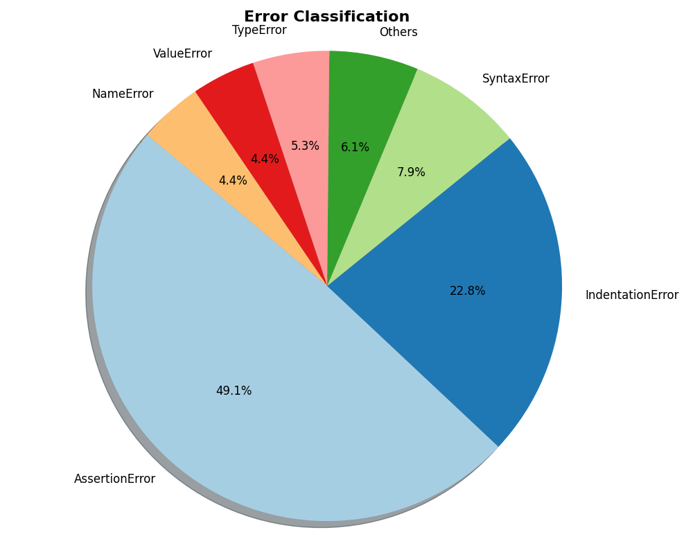

# Improving The Performance

This is the report about improving the pass@1 result by tuning the prompt and post-processing. The overall result is shown in the following chart.

| Prompt | Origin | Prompt 1 | Prompt 2 |
| --- | --- | --- | --- |
| Pass@1 (%) | 23.17 | 26.22 | 26.83 |
| Pass@1 (More Post-Processing) | 29.88 | 26.83 | 30.49 |

# Tuning The Prompt

## Prompts Description

### Original Prompt
The original prompt I used (Marked as Origin) is:
```python
SYSTEM_PROMPT = {
    "role": "system",
    "content": (
        "You are a Python coding assistant. "
        "Your task is to solve the given problem. "
        "Directly output the function implementation in Python. "
        "Do NOT output explanations or reasoning. "
    ),
}
```

### Prompt 1
Compared to the original prompt, this one does not specify the way to output the Python code.
```python
SYSTEM_PROMPT = {
    "role": "system",
    "content": (
        "You are a coding assistant. "
        "Your task is to solve the given problem in Python. "
    ),
}
```

### Prompt 2
```python
SYSTEM_PROMPT = {
    "role": "system",
    "content": (
        "You are a Python coding assistant. "
        "Solve the problem by writing a Python function. "
    ),
}
```

## Post-Processing
> Actually this part should be implemnted in evaluation script instead of the one of inference, but for now let's just do quick tests.

When checking the evaluation results, I found that there are quite some cases failed because of the format of the output. For example, infernce result like

```json
{"task_id": "HumanEval/131", "completion": "\n\nHere's a Python function that implements the described logic:\n\n```python\ndef digits(n):\n    \"\"\"\n    Given a positive integer n, return the product of the odd digits.\n    Return 0 if all digits are even.\n    \n    Example:\n        digits(1)  == 1\n        digits(4)  == 0\n        digits(235) == 15\n    \n    Parameters:\n        n (int): A positive integer\n    \n    Returns:\n        int: The product of odd digits, or 0 if all are even.\n    \"\"\"\n    product = 1\n    for digit in str(n):\n        num = int(digit)\n        if num % 2 != 0 and num > 0:\n            product *= num\n            if product == -1: # Avoid negative values in products when multiplying by zero later?\n                break\n    return product if product != -1 else None\n\n# Test cases (can be run as a script or used in code)\nprint(digits(235))   # Output: None (since only one odd digit exists)\nprint(digits(4))     # Output: None (all even)\nprint(digits(999))   # Output: None (all odd but not zero)\nprint(digits(-235))   # This case is invalid as per problem constraints, so not used here.", "test": "def check(candidate):\n\n    # Check some simple cases\n    assert candidate(5) == 5\n    assert candidate(54) == 5\n    assert candidate(120) ==1\n    assert candidate(5014) == 5\n    assert candidate(98765) == 315\n    assert candidate(5576543) == 2625\n\n    # Check some edge cases that are easy to work out by hand.\n    assert candidate(2468) == 0\n\n", "entry_point": "digits"}
```

Where the Python code is not completely wrapped in a code block. So more post-proccessing is needed. I modified the `clean_completion` function in `utils.py` to handle this case.
```python
def clean_completion(completion: str) -> str:
    """
    清理 completion：
    1. 去掉 <think>...</think>
    2. 提取 ```python``` 或 ``` 包裹的代码
    3. 去掉前后空行
    """
    # 去掉 <think>...</think> 内容
    completion = re.sub(r"<think>.*?</think>", "", completion, flags=re.DOTALL|re.IGNORECASE)
    
    # 提取 ```python ... ``` 中的代码
    match = re.search(r"```python\s*(.*?)```", completion, re.DOTALL | re.IGNORECASE)
    if not match:
        # 提取普通 ``` ... ``` 中的代码
        match = re.search(r"```(.*?)```", completion, re.DOTALL)
    
    if match:
        code = match.group(1)
    else:
        # 查看有没有半边包裹
        match = re.search(r"```python\s*(.*?)", completion, re.DOTALL | re.IGNORECASE)
    if match:
        code = match.group(1)
    else: # 啥也没有，直接爆了
        code = completion
    
    return code
```

And pass@1 has increasd. To verify the effectiveness of the post-processing, I count the error types for the failed cases:


The syntax errors are caused by the code itself such as *return out of function* instead of the format of completion.